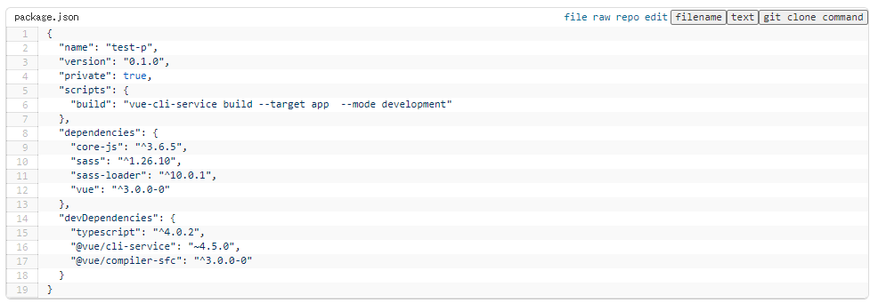
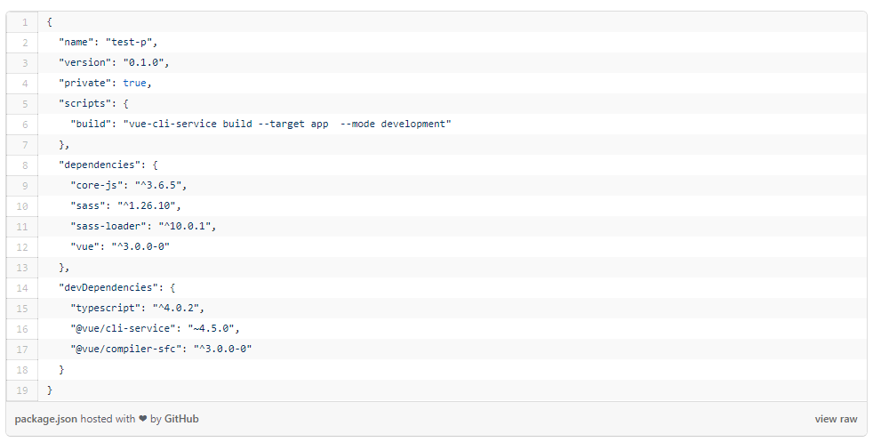

# 概要

github gistのembed表示をカスタムするuser.jsファイル

after


before



- 行間を狭く
- ファイル、生ファイル、レポジトリ、編集ページへのリンクを追加
- ファイル名、ファイルの中身、git cloneコマンドをボタンクリックでコピー
  - ファイルの中身はinnerTextベースなので、markdownされたファイルでは実際の生ファイルと挙動が異なる場合あり。
- フッター削除

# 動作確認環境

- google chrome
- windows10
- Tampermonkey

# 使い方

- ビルドをしてout/main.jsを作成
- Tampermonkeyで指定。以下、指定サンプル

```
// ==UserScript==
// @name         github markdown util
// @require      file:///C:\xxxx\out\main.js
// @noframes
// ==/UserScript==
```


# ビルド方法

- `npm ci`
- `npm run build`

# Licence
MIT License